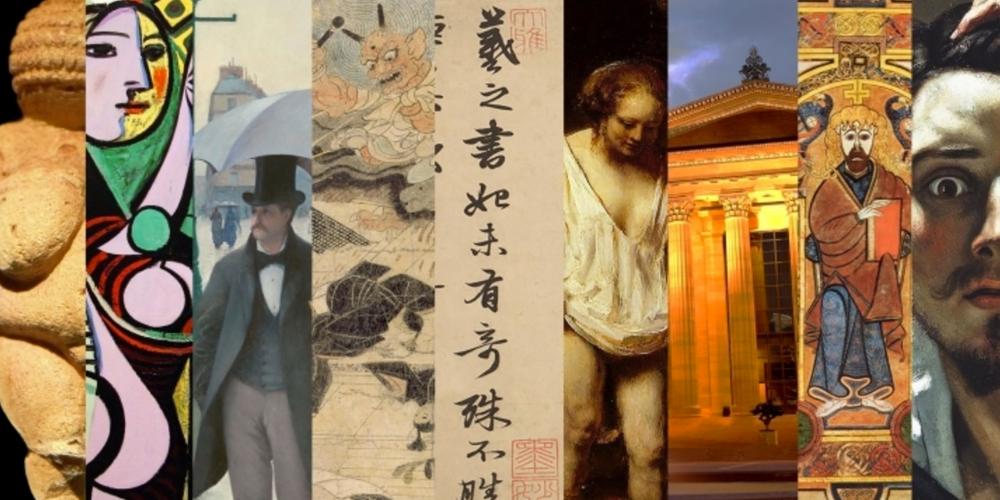

# Spark AR Creative Workshop : Mexico

<!--  -->

### ¿Que haremos?

### ¿Qué tenemos que hacer para empezar?

0. [Creacion de assets.](https://github.com/malvabombom/Spark-AR-Creative-Serie#0-creacion-de-assets)
1. [Introducción a Spark AR.](https://github.com/malvabombom/Spark-AR-Creative-Serie#1-introducci%C3%B3n-a-spark-ar)
2. [Uso del rastreador de Imagenes.](https://github.com/malvabombom/Spark-AR-Creative-Serie#2-uso-del-rastreador-de-imagenes)
3. [Pruebar nuestros efectos.](https://github.com/malvabombom/Spark-AR-Creative-Serie#3-pruebar-nuestros-efectos)
4. [A publicar nuestro filtro Spark AR.](https://github.com/malvabombom/Spark-AR-Creative-Serie#4-a-publicar-nuestro-filtro-spark-ar)
5. [Recomendaciones finales.](https://github.com/malvabombom/Spark-AR-Creative-Serie#5-recomendaciones-finales)

## ¡Comencemos con nuestro primer efecto!

### 0. Creacion de assets.

### 1. Introducción a Spark AR.

### 2. Uso del rastreador de Imagenes.

### 3. Pruebar nuestros efectos.

### 4. A publicar nuestro filtro Spark AR.

### 5. Recomendaciones finales.

